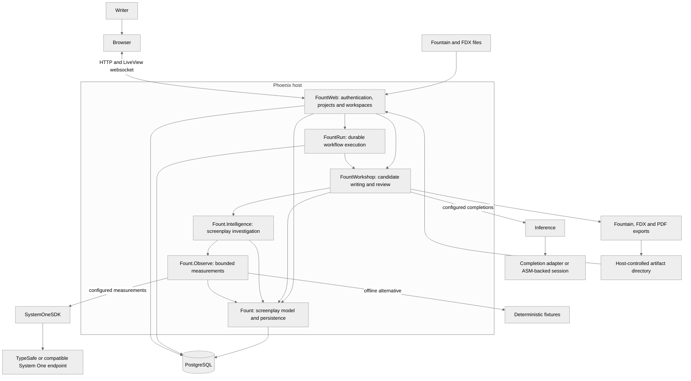
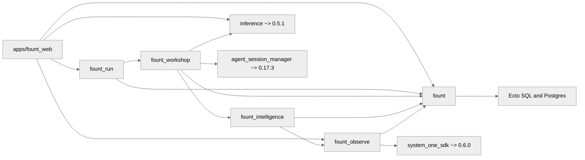
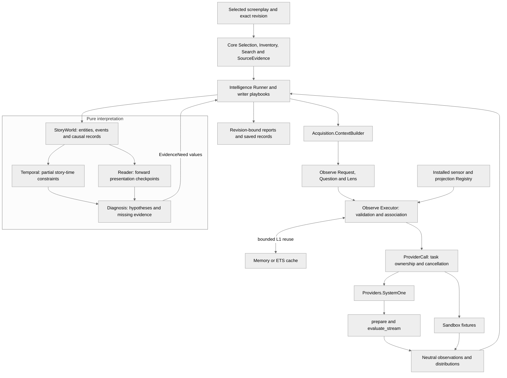
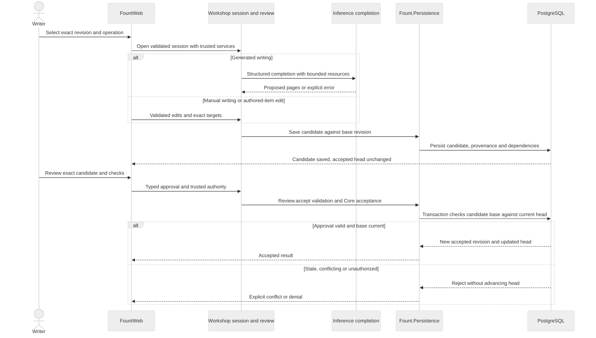
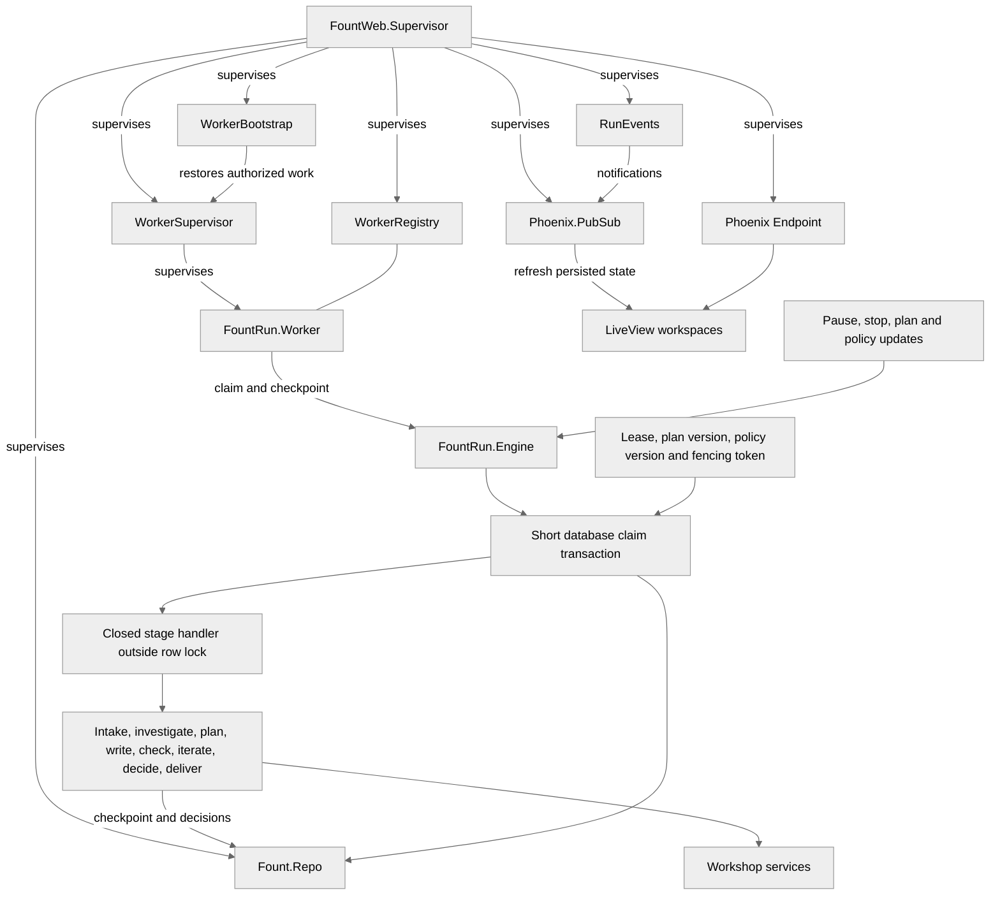
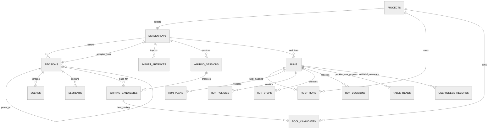
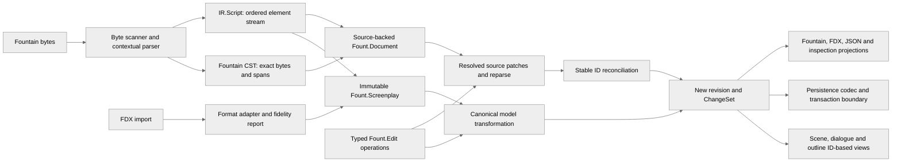

# Fount architecture

Snapshot: `de5e9549794368bf38ab774bdf304ce4c76c28ca`. Fount is a Phoenix host over five independently built screenplay packages. PostgreSQL stores screenplay revisions, candidate writing, analysis and durable runs. The accepted draft changes through Core's validated acceptance transaction, not merely when pages are generated or saved.

## 1. System view

Arrows show requests or data movement. External model services are optional and explicitly configured; the development launcher uses deterministic analysis and a demo completion adapter.

The Web host owns credentials, owner identity, Repo startup, workers and artifact paths. Library calls receive those services explicitly. There is no requirement for a vector database, live provider or separate System One server to inspect a screenplay locally.

## 2. Package dependencies

Here `A --> B` means **A depends on B**, not execution order. Repeated direct Core dependencies are included because they define the shared model boundary.

Only Observe owns System One integration. Only Workshop owns completion integration. ASM is a published dependency; the live launcher selects it through `Inference.Adapters.ASM`. No lower package imports Run or the Phoenix host. The root workspace orchestrates independent package builds; it is not an Elixir umbrella.

## 3. Analysis components

Solid arrows show selected input, calls or results. The pure interpretation boundary receives explicit values and evidence; provider handles stay in the acquisition shell.

Source order, story-time order and causality are separate coordinates. The Reader cannot consume evidence from future pages. Exact search does not dispatch providers. Intelligence can request missing evidence and diagnose a concern, but cannot write or accept screenplay pages. The L1 cache is not durable analytical storage.

## 4. Editing and acceptance

This sequence covers manual and generated candidate work. A draft save, note edit or cast rename does not itself advance the accepted head.

Source-backed edits reconcile stable IDs after parsing and retain exact revision/source anchors. Changed note targets become `stale_changed`; deleted targets become `unresolved`. Remapping is explicit. Analysis annotations remain separate from writer-authored items.

## 5. Runtime and workflow control

Arrows show supervision, notification or stage dispatch, as labeled. The shared Repo has migrations from Core, Run and the host.

Model calls and reviewer calls execute outside Run row locks. Pause blocks new dispatch; stop fences old work while retaining saved results. Plan/policy updates use versioned snapshots. Decisions bind the authorized respondent and exact context. Reconnects reload persisted state; LiveView notifications are not the durable record. Browser draft recovery is distinct from server candidate storage.

## 6. Stored data view

This is a reduced logical map of actual table relationships, not a complete DDL diagram. `HOST_RUNS` maps a project to a Core Run row. Most entities also carry screenplay/revision and owner bindings beyond the edges shown.

`PROJECTS`, `HOST_RUNS`, `TOOL_CANDIDATES`, `TABLE_READS` and `USEFULNESS_RECORDS` denote the `fount_web_*` tables; `RUN*` denotes `fount_run*`. An accepted-head edge is a selected reference, not a second revision store. The project/screenplay link is unique in the host. The map omits analysis tables, authoring drafts/commands, delivery records and the rest of the typed screenplay rows to keep the main relationships readable.

## 7. Core representation and edit pipeline

Arrows show transformations. The byte-preserving source representation and the normalized screenplay model answer different questions; reports and analysis do not replace either.

Offsets locate text; stable IDs identify objects. Scenes/dialogue/outline are views over a single ordered element stream. External rewrites use best-effort reconciliation and emit diagnostics when identity cannot be retained. Pure model construction and edits need no running database; storing or accepting a revision uses the PostgreSQL boundary.

## Inspection and output coverage

The viewer, editor and analysis workspace sit alongside provider-free literal search, cast profiles, location/scene inspection and writer notes. Table-read packets retain source identity and optimistic versioned progress; TTS is available only when configured. Usefulness records separate engineering facts from optional human judgments. Project dashboards and imports remain owner-scoped and capped. Fountain/FDX fidelity reporting and PDF inspection are output concerns, not screenplay truth; PDFs use Afterwriting 1.17.3 with PDFKit 0.20.2 and external PDF inspection utilities.

## Source map

All links refer to the reviewed commit:

- [Host application and supervision](https://github.com/nshkrdotcom/fount/blob/de5e9549794368bf38ab774bdf304ce4c76c28ca/apps/fount_web/lib/fount_web/application.ex), [routes](https://github.com/nshkrdotcom/fount/blob/de5e9549794368bf38ab774bdf304ce4c76c28ca/apps/fount_web/lib/fount_web/router.ex), [host service configuration](https://github.com/nshkrdotcom/fount/blob/de5e9549794368bf38ab774bdf304ce4c76c28ca/apps/fount_web/lib/fount_web/services.ex).
- [Core architecture](https://github.com/nshkrdotcom/fount/blob/de5e9549794368bf38ab774bdf304ce4c76c28ca/packages/fount/guides/architecture.md), [Observe architecture](https://github.com/nshkrdotcom/fount/blob/de5e9549794368bf38ab774bdf304ce4c76c28ca/packages/fount_observe/guides/architecture.md), [Intelligence architecture](https://github.com/nshkrdotcom/fount/blob/de5e9549794368bf38ab774bdf304ce4c76c28ca/packages/fount_intelligence/guides/architecture.md).
- [Workshop architecture](https://github.com/nshkrdotcom/fount/blob/de5e9549794368bf38ab774bdf304ce4c76c28ca/packages/fount_workshop/guides/architecture.md), [Run architecture](https://github.com/nshkrdotcom/fount/blob/de5e9549794368bf38ab774bdf304ce4c76c28ca/packages/fount_run/guides/architecture.md).
- [Core migrations](https://github.com/nshkrdotcom/fount/tree/de5e9549794368bf38ab774bdf304ce4c76c28ca/packages/fount/priv/repo/migrations), [Run migrations](https://github.com/nshkrdotcom/fount/tree/de5e9549794368bf38ab774bdf304ce4c76c28ca/packages/fount_run/priv/repo/migrations), [host migrations](https://github.com/nshkrdotcom/fount/tree/de5e9549794368bf38ab774bdf304ce4c76c28ca/apps/fount_web/priv/repo/migrations).
