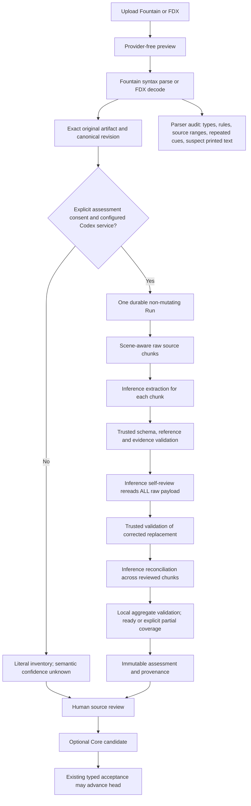
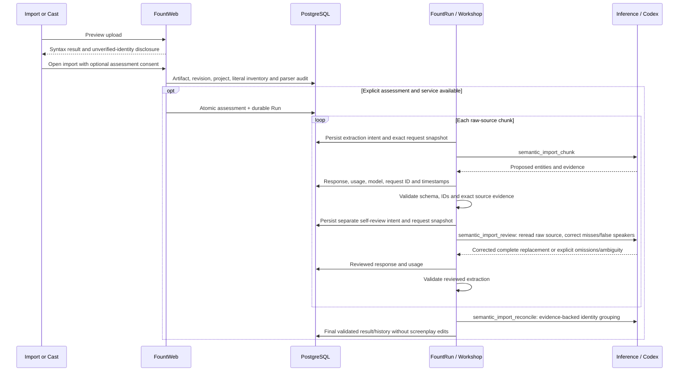

# Screenplay import, source review and debugging

Import has two separate outcomes: exact source preservation and proposed semantic identities. Parsing Fountain syntax does not establish that an uppercase cue is a person. Repeated cue spelling does not establish that occurrences are the same person. An import can succeed structurally while its identities remain **unverified**.

## Complete workflow



The original Fountain/FDX artifact is preserved byte-for-byte, with its SHA-256 and revision binding. Parser audit is stored in the manual assessment's `result.import_audit`, even without inference. It records parser version, every element's type/rule/line/byte ranges, cue occurrence counts versus distinct spellings, and suspect printed-text cues. Suspect cues are **diagnostic hints**, not exclusions: colon/long/document-like cues can still be real speakers. Ranges identify the visible Fountain revision, with a separate visible-source hash; FDX ranges refer to the decoded revision, while the source hash identifies the exact original FDX artifact. The parser is deliberately not changed into an English keyword blacklist. Raw source remains available for semantic review, including action/prose that the parser did not classify as a speaker.

Cast shows at most 20 occurrence/identity cards per page and offers spelling groups with counts. This prevents a full-length script from generating a card and large merge picker for every cue simultaneously. A spelling group is not an automatic identity merge. Generic roles, age variants and unresolved aliases remain separate until evidence or deliberate human review supports grouping. The parser audit and full source-review JSON are accessible from Cast.

## Calls and self-review



All model calls use explicit `gpt-6.1-sol` / `low`; no silent model fallback. Extraction and self-review each get at most one bounded decode/schema repair. Reconciliation also gets at most one repair. For `N` chunks, successful ordinary execution uses **2N + 1** calls; the bounded ceiling including repairs is **4N + 2**, at most 258 for 64 chunks. Native JSON Schema and JSON-text fallback use the same trusted validator. The review sees the original chunk spans, context/exclusion boundaries and literal IDs, plus a bounded proposal summary (at most 200 entries / 8 KB); it must reread the source rather than treat that summary as exhaustive.

Self-review is a second completion using the same model, not an independent ground-truth oracle. It targets missed prose people, printed-text false speakers, role/presence mistakes and unsupported alias merges. Schema validation proves source grounding and reference integrity, **not semantic truth**. We do not manufacture a numerical confidence or claim zero errors. Unresolved identity/role ambiguity or omitted spans remain explicit; human decisions retain precedence and promotion remains candidate-only. Quantified precision/recall requires a human-labeled evaluation set. Repeated agreement from one model is not calibrated confidence.

**System One/Observe is not called by this import assessment workflow.** It serves separate analytical measurements. Adding System One transport logging would not explain these parser failures, so this change does not add another global logging framework.

## Queryable audit

Run `mix fount_web.import.audit PROJECT_KEY` from `apps/fount_web` with the same `FOUNT_DATABASE_URL` as the server. This reads the owned project's parser counts/anomalies, assessment state and call summaries; it dispatches no inference. Raw prompts are deliberately omitted from the command's default output. The command uses the configured owner identity.

From the authenticated project, **Export source review JSON** includes the full `import_audit`, immutable assessment histories and review events. To inspect exact request bodies, query the database locally:

```sql
-- Substitute the project key. Keep raw prompts private: they contain screenplay text.
SELECT pr.run_id, s.stage, pr.status,
       pr.request_snapshot->>'purpose' AS purpose,
       pr.request_snapshot->>'model' AS requested_model,
       pr.response->>'model' AS returned_model,
       pr.request_snapshot->>'reasoning_effort' AS reasoning_effort,
       pr.request_snapshot->>'prompt' AS exact_prompt,
       pr.request_snapshot->'schema' AS schema,
       pr.response, pr.error_category, pr.usage,
       pr.malformed_repair, pr.transport_retry,
       pr.dispatched_at, pr.responded_at
FROM fount_run_provider_requests pr
JOIN fount_run_steps s ON s.id = pr.step_id
JOIN fount_web_runs wr ON wr.run_id = pr.run_id
JOIN fount_web_projects p ON p.id = wr.project_id
WHERE p.owner_id = 'local-owner' AND p.key = 'YOUR_PROJECT_KEY'
ORDER BY pr.intended_at, pr.id;

SELECT sa.origin, sa.status, sa.source_sha256, sa.revision_id,
       sa.result->'import_audit' AS parser_audit, sa.coverage, sa.error
FROM fount_web_semantic_assessments sa
JOIN fount_web_projects p ON p.id = sa.project_id
WHERE p.owner_id = 'local-owner' AND p.key = 'YOUR_PROJECT_KEY'
ORDER BY sa.inserted_at;
```

The existing call ledger records intent before dispatch, normalized response after dispatch, retries/repairs, request/response hashes, usage, backend request ID, errors and timestamps. `request_snapshot` adds purpose, exact prompt/schema and a whitelist of model/provider/reasoning settings; it never copies client credentials or arbitrary adapter options. Source-revision ownership is joined through the existing Run/project records. Unknown dispatch acknowledgement remains ambiguous and is not automatically replayed. Saved responses can be reused after worker restart. Local failures are also recorded in `fount_run_steps`, `fount_run_attempts` and `fount_run_events`; transport success alone does not mean schema/semantic validation passed.

## Reimport and service configuration

Apply Core -> Run -> host migrations with `mix fount_web.migrate`. The Run migration `20261002030000_provider_request_audit.exs` is required for request snapshots; assessment refuses a missing snapshot schema before creating its Run. No existing import backfill or legacy migration path is introduced.

Preview/import/manual review make **zero provider calls**. With assessment disabled, an import stays unverified and self-review does not run. To use real assessment in your dev server, explicitly start it with `FOUNT_SEMANTIC_ASSESSMENT_MODE=codex` and `FOUNT_CODEX_AUTH_ASSERTED=true` after local Codex authentication; set `CODEX_PATH` if needed. This enables availability, not automatic consent: select **Assess cast & locations after import**, or use **Assess this draft** in Cast. These actions send source text to Codex and use the call budget described above. Automated checks use `MIX_ENV=test FOUNT_SEMANTIC_ASSESSMENT_MODE=deterministic_fixture`; fixture results are labeled and do not prove live model quality.

For a reported bad character, locate its cue/evidence range, inspect the parser decision and surrounding source, then compare extraction and review responses. A suspicious literal cue before any calls is a parsing ambiguity; disappearance/addition between the two responses is a semantic review correction; duplicated occurrence cards with identical spelling are presentation/grouping rather than proof of multiple people. This separates source preservation, syntax classification, model interpretation, identity reconciliation and human acceptance when diagnosing a failure.
