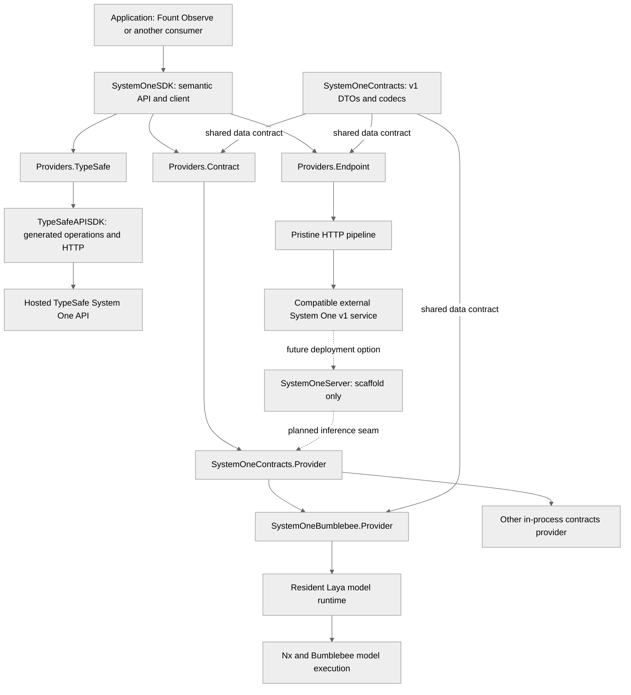
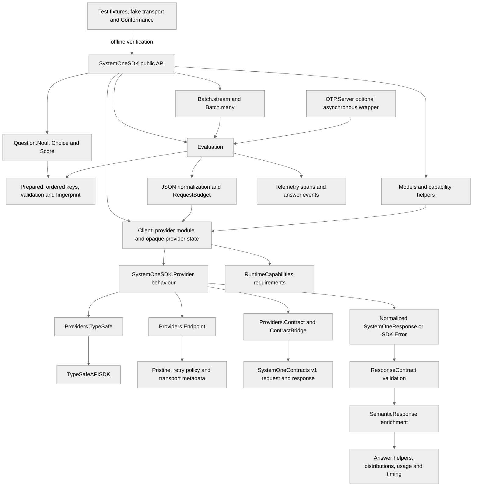
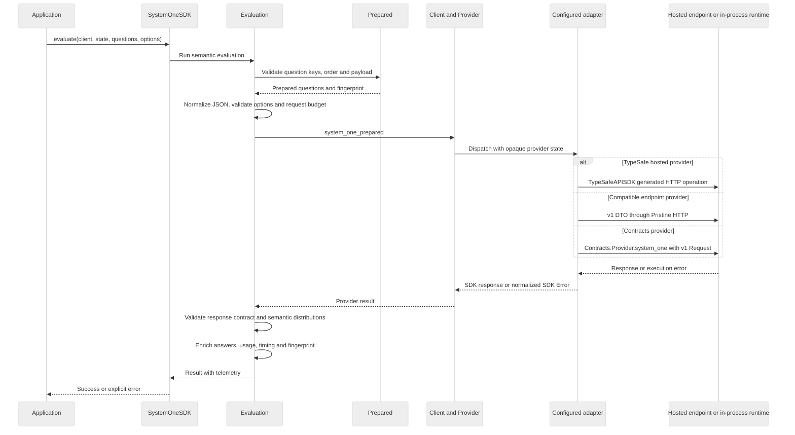
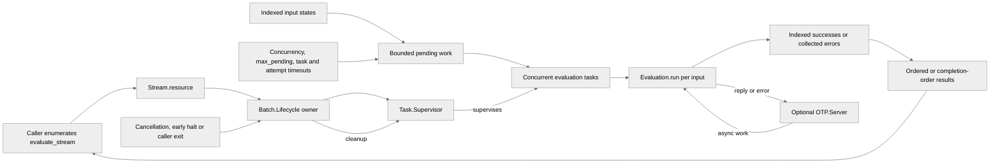
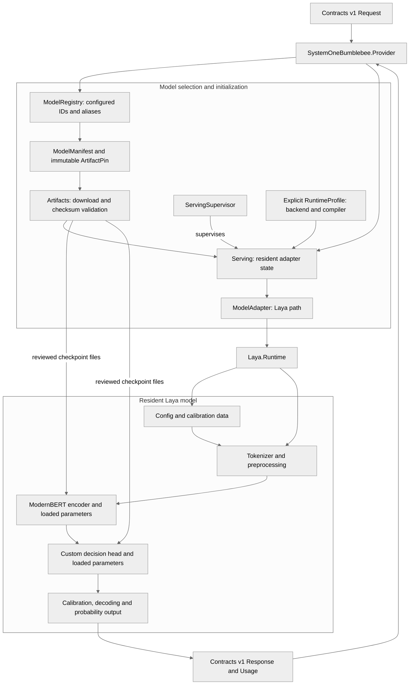

# System One SDK architecture

Snapshot: `155c3309892dfacdebe2a2f1256fa71e03dc545d`. This repository contains four independent Mix projects, not an umbrella. The rich client is SystemOneSDK 0.6.0; the shared wire/inference package is SystemOneContracts 0.1.0. The SDK can use hosted HTTP, a compatible endpoint or an in-process contracts provider.

The diagrams distinguish checked-in implementation from future service exposure. Some overview documents still describe native execution as planned; the inspected source already contains the Bumblebee provider, resident Laya runtime, checkpoint loaders and model intake tools. That does not imply every model/backend combination has been validated or that downloads are automatic. SystemOneServer remains a scaffold with no serving API.

## 1. Ecosystem view

Solid arrows show calls or translated data. Dashed arrows show the planned HTTP server path, which is not implemented at this snapshot.

Hosted use does not require Bumblebee, Nx, EXLA, Plug or Bandit. The main SDK has no dependency on the optional native/server packages. Native providers and the planned server depend inward on Contracts, not back on the rich SDK. External process/container lifecycle belongs outside the native inference package.

## 2. SDK components

Arrows show calls and data use, not a complete compile-time dependency graph. Provider-specific response types terminate at the adapters and are normalized into SDK results.

`Noul`, `Choice` and `Score` are semantic question families, not text-generation modes. `Prepared` preserves question ordering and identity across calls. The rich SDK owns semantic validation, response enrichment and batch policy. TypeSafeAPISDK owns its provider's HTTP/auth/defaults, generated operations, wire schemas, retries and raw transport metadata; this repo does not recreate that code generation layer.

## 3. One semantic evaluation

The provider seam is selected once in client configuration. Preparation, request-size checks and response validation are common across providers.

This is the success path with errors summarized, not a claim that failed validation continues to dispatch. Invalid input fails before execution; malformed or incompatible output fails at the response boundary. Telemetry spans cover the operation, including failures. Adapter-specific retry/timeout handling stays distinct from batch worker limits.

## 4. Batch and OTP lifecycle

Arrows show ownership and work flow. Streaming is lazy; `many` collects the stream into a list. Each input has an index so callers can associate unordered completion with the original request.

Batch owns its task lifecycle rather than leaving work running when enumeration stops. The OTP helper supports application-owned GenServer integration and pending task replies; it is not SystemOneServer and does not expose an HTTP endpoint. The library has no mandatory global client supervisor.

## 5. Native runtime detail

This view zooms into the optional `system_one_bumblebee` package. Solid arrows show loading or inference; initialization and the inference path are separated into groups.

`Serving` owns initialization and state lifetime; it supplies a fast immutable snapshot so inference runs outside the GenServer mailbox. The Laya runtime loads encoder/head parameters, tokenizer and calibration once, then batches the questions within a request through resident state. The registry does not let requests choose arbitrary Hugging Face repositories. Artifact acquisition uses configured manifests, HfHub download support and checksum/manifest validation. EXLA is optional; the host supplies backend/compiler choices explicitly.

Model intake/checkpoint accounting and fake adapters support preparation and offline verification. Their presence is not a promise of unqualified production readiness. HTTP authentication, service routing and container lifecycle are outside this package.

## 6. Boundary summary

| Boundary | Owns | Does not own |
| --- | --- | --- |
| SystemOneSDK | Semantic questions, preparation, response validation, batching, telemetry, OTP helpers, runtime requirements and conformance | Model checkpoint storage or an HTTP server |
| SystemOneContracts | v1 DTOs/codecs, ordered question entries, error/capability vocabulary and inference-provider behaviour | HTTP transport, client retries or model lifecycle |
| TypeSafeAPISDK | Hosted TypeSafe HTTP/auth, generated operations and provider wire formats | Fount interpretation or candidate acceptance |
| SystemOneBumblebee | Configured models, pinned artifacts, resident native execution | Hosted credentials, HTTP exposure or container management |
| SystemOneServer | Planned v1 HTTP facade; current scaffold | A currently available serving implementation |

Fount consumes the rich SDK only through Observe's `Providers.SystemOne`: neutral questions become SDK questions, `prepare` and `evaluate_stream` run, and SDK-native results/errors become neutral observations. Fount's completion writing uses Inference separately; the two paths are not interchangeable.

## Source map

All links refer to the reviewed commit:

- [SDK provider behaviour](https://github.com/nshkrdotcom/system_one_sdk/blob/155c3309892dfacdebe2a2f1256fa71e03dc545d/packages/system_one_sdk/lib/system_one_sdk/provider.ex), [Client](https://github.com/nshkrdotcom/system_one_sdk/blob/155c3309892dfacdebe2a2f1256fa71e03dc545d/packages/system_one_sdk/lib/system_one_sdk/client.ex), [Evaluation](https://github.com/nshkrdotcom/system_one_sdk/blob/155c3309892dfacdebe2a2f1256fa71e03dc545d/packages/system_one_sdk/lib/system_one_sdk/evaluation.ex).
- [Batch](https://github.com/nshkrdotcom/system_one_sdk/blob/155c3309892dfacdebe2a2f1256fa71e03dc545d/packages/system_one_sdk/lib/system_one_sdk/batch.ex), [batch lifecycle](https://github.com/nshkrdotcom/system_one_sdk/blob/155c3309892dfacdebe2a2f1256fa71e03dc545d/packages/system_one_sdk/lib/system_one_sdk/batch/lifecycle.ex), [OTP helper](https://github.com/nshkrdotcom/system_one_sdk/blob/155c3309892dfacdebe2a2f1256fa71e03dc545d/packages/system_one_sdk/lib/system_one_sdk/otp/server.ex).
- [Provider adapters](https://github.com/nshkrdotcom/system_one_sdk/tree/155c3309892dfacdebe2a2f1256fa71e03dc545d/packages/system_one_sdk/lib/system_one_sdk/providers), [contracts provider seam](https://github.com/nshkrdotcom/system_one_sdk/blob/155c3309892dfacdebe2a2f1256fa71e03dc545d/packages/system_one_contracts/lib/system_one_contracts/provider.ex).
- [Native package implementation](https://github.com/nshkrdotcom/system_one_sdk/tree/155c3309892dfacdebe2a2f1256fa71e03dc545d/packages/system_one_bumblebee/lib/system_one_bumblebee), [resident Laya runtime](https://github.com/nshkrdotcom/system_one_sdk/blob/155c3309892dfacdebe2a2f1256fa71e03dc545d/packages/system_one_bumblebee/lib/system_one_bumblebee/models/laya/runtime.ex), [server scaffold](https://github.com/nshkrdotcom/system_one_sdk/blob/155c3309892dfacdebe2a2f1256fa71e03dc545d/packages/system_one_server/lib/system_one_server.ex).
