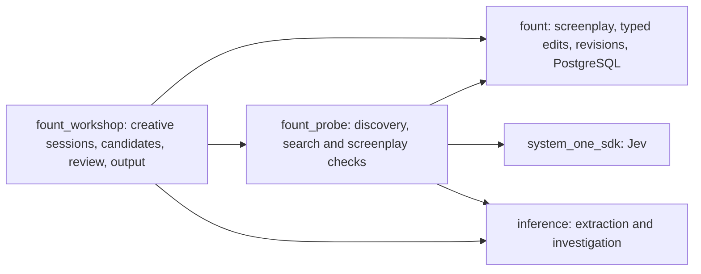

# Architecture derived from the writing workflows

## Package ownership

`fount` supplies deterministic screenplay operations, source preservation and PostgreSQL persistence. It knows the shapes of revisions, authored metadata, change groups and stored JSON payloads. It does not execute prompts, interpret craft, or depend on model SDKs. `Document` remains the lossless source representation. `Screenplay` is the canonical authored representation.

`fount_probe` supplies the toolbelt in 07: retrieving relevant evidence, extracting candidate story interpretations, evaluating questions, finding dependencies and comparing speculative changes. Its tools accept explicit screenplay values and clients and return evidence-addressed reports. They can run without a database once their input revisions have been loaded. Querying history uses an explicit history reader supplied by the caller. Probe never creates or accepts screenplay edit proposals.

`fount_workshop` owns the creative operations in 01a. It combines writer direction, exact context, Probe tools and Inference to produce strategies and candidate pages. It owns writing sessions, proposal decoding, selective combination, review packets, CLI commands, PDF and rehearsal. Every writing workflow is usable headlessly. No graphical editor or always-running application server is required.

## Decisions with feature reasons

| Decision | Implementation | Required by |
| --- | --- | --- |
| Three independent Mix projects | Core has no AI dependency; Probe adds System One and Inference; Workshop consumes both. | Agents can use tools or full writing operations independently. |
| Authored state separate from interpretation | `authored_items` in canonical revisions; analysis reports stored separately against exact revisions. | Writer intentions and beat plans must not become whatever a model last inferred. |
| Revision-scoped relational rows | Full immutable screenplay state per revision, loaded by one reader for current, old and candidate drafts. | W02/W03/W04/W08 compare, query, combine and recover actual drafts. |
| Complete candidate revisions | Each candidate has one parent, grouped typed edits and an immutable resulting model. | Audition in context, resume review, render alternatives, partial selection. |
| Domain sessions | A session stores one writer request, strategies, candidates, evidence and decisions. | Resuming creative work and choosing among approaches. This is not a general job runtime. |
| Evidence-driven tools | JSON input contracts plus functions with screenplay-specific behavior; small versioned profile assets. | W03/W05/W09 need more than prompt-only assertions about a whole screenplay. |
| Creative composition | Fixed workflow functions with application-owned Inference rounds and calls to known tools. | Codex completion can plan and write while Fount retains exact editing authority. |
| Explicit provenance | Acceptance and authored changes distinguish writer edits, generated text, generated structure and analysis-only use. | Recovering alternatives and explaining what entered the draft. |
| Exact source scope | Model state includes only relevant source plus declared context; reports record inspected/excluded material. | Knowledge, mystery, voice and historical evidence can be contaminated by the wrong text. |
| Offline tests, real examples | Doubles only at external service/process boundaries in default tests; three live entrypoints. | Fast development and genuine demonstration of writing/export/database behavior. |

## The shared writing mechanism

All nine workflows use a common set of functions, with workflow-specific context and prompts:

1. Normalize the brief, selection and constraints against the base revision.
2. Retrieve context and inspect relevant story material using Probe when needed.
3. Produce strategies for substantial creative changes, or go straight to edits for a small pass.
4. Generate typed change groups using the selected strategy and actual target IDs.
5. Apply edits to a pure candidate; validate the result and test protected requirements.
6. Optionally repair failures within the requested writing task. Retain failed alternatives with their reports.
7. Save and present candidates, allow combination/selection, and accept only through the explicit acceptance API.

This is ordinary domain code. Do not implement Workflow/Stage/Task abstractions, a generic DAG interpreter, autonomous agent infrastructure, a distributed queue or a plugin framework. Tools have static names and validated parameters; the Inference response may select tools and propose writing strategies, but cannot supply executable code.

A user request can authorize generated repairs, retries and related edits within its scope. It does not authorize changing the accepted draft until `accept`. Avoid prompting the user at every model call. When a genuine creative choice remains, return usable alternatives rather than asking the writer to solve the whole problem upfront.

## Modules and ownership

| Package | Existing modules to improve | New responsibilities |
| --- | --- | --- |
| Core | `Screenplay`, `Edit`, `Query`, `Index`, `Validate`, `Writer`, `Persistence`, codecs and adapters | `Slice`, typed `Target`, authored items, sequence operations, change impact, revision-scoped storage |
| Probe | New package | `Tools`, `State`, `Profile`, `Executor`, `Report`, `Search`, `Extraction`, knowledge/dependency/continuity/scene/dialogue/voice/action/constraint/compare tools |
| Workshop | `Proposal`, `Preview`, `Acceptance`, PDF, table read, submission | `Brief`, `Session`, `Strategy`, `Candidate`, `Context`, `Workflows`, `Review`, command dispatch and saved candidate handling |

Create a separate module only when it owns real behavior. Shared math can be private functions until multiple implemented tools need it. Reuse the core semantic graph structs for dependency reports; no second graph database or graph runtime is needed.

## Practical execution rules

Library code receives explicit options and clients. Environment lookup belongs in host runtime configuration or executable launch code. JSON payloads contain string keys, UTF-8 strings, finite numbers, booleans, lists and null; fixed enums use explicit conversion tables. No user/model input creates atoms.

The SDK owns transport, retries, request validation and batching. Fount supplies state, questions, workload counts and result interpretation. Do not add SDK capability emulation. Inference supplies generation and structured completion; its installed ASM/Codex support is used as documented in 08.

Reports are immutable and belong to their exact input revisions. Retain old reports; label them historical when the head changes. No automatic cross-revision result reuse in this release. Within one session, deduplicate identical request fingerprints and retain results for resume. `ChangeImpact` selects what to check in a candidate; it is not a background cache invalidation service.

Use PostgreSQL, ordinary functions and SDK batching. No vector database, Redis, event bus, cross-database persistence framework or custom HTTP client is needed for these features. Search at screenplay scale starts with structured filtering, full-text retrieval and model relevance judgments over candidate passages; an exhaustive scene inventory scan is available when retrieval must inspect the whole draft.
